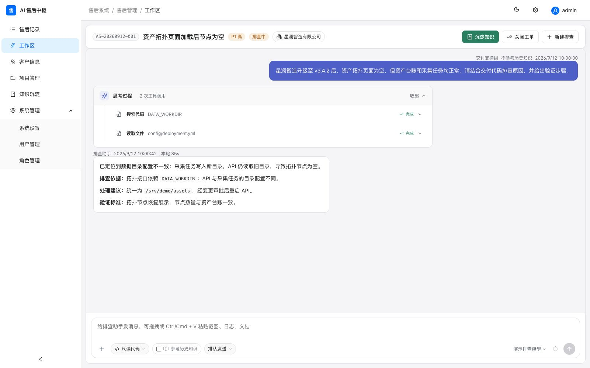
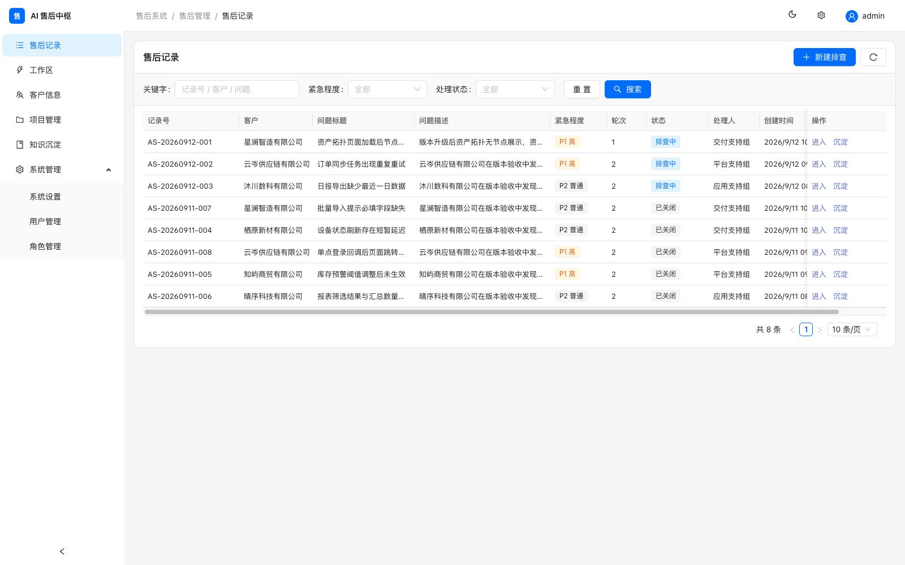
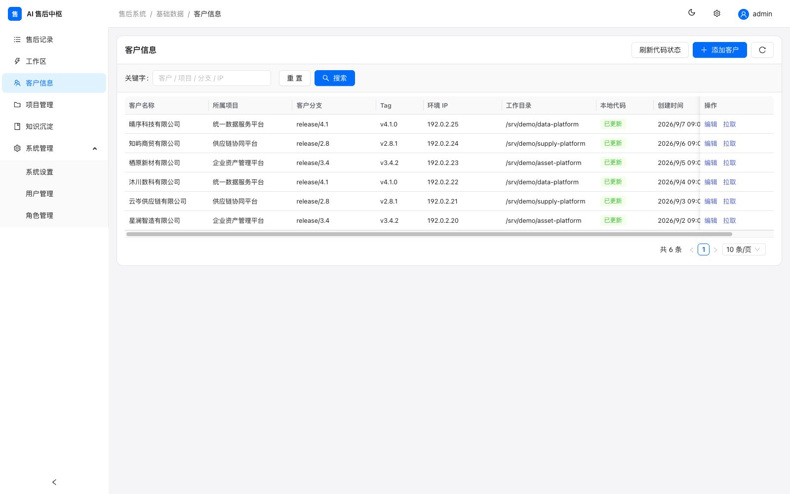
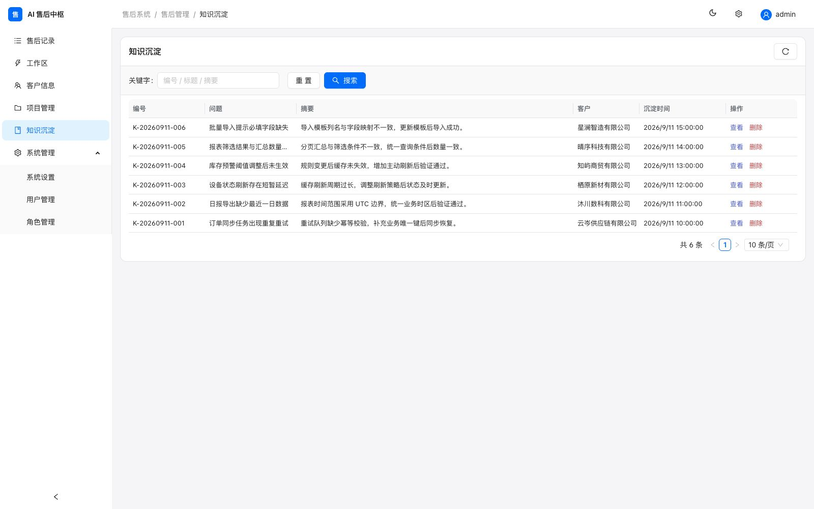

# AI 售后系统

**面向软件交付与售后支持团队的 AI 辅助排查与知识管理平台。**

面向软件交付与售后支持团队，围绕“客户遇到问题 → 核对交付版本 → 排查代码与环境 → 验证处理结果 → 沉淀知识”的日常流程，集中管理项目、客户、工单和排查记录。团队可以按客户版本定位问题、查看工具执行过程，形成可追溯、可复用的服务记录。

[快速部署](#快速启动) · [完整文档](docs/README.md) · [初始化 SQL](docs/sql/init.sql) · [演示数据说明](docs/demo/README.md)

## AI 排查工作台

在工单中描述问题、补充截图或日志，结合客户交付代码开展多轮排查。工作区集中展示用户问题、工具调用过程、排查依据与处理建议，支持选择模型、控制环境访问权限和按需参考历史知识。



> 本页截图来自独立演示环境。所有公司、项目、工单、知识与对话均为人工编写的虚构样例，不含真实客户信息；工具结果与排查结论仅用于展示界面，不代表实际模型调用或客户现场执行。环境地址使用文档示例网段，仓库与模型地址使用 `example.com` 子域名。

## 核心能力

| 能力 | 支持的工作 |
| --- | --- |
| 售后工单 | 按客户、优先级与状态管理问题，保留多轮排查记录和处理结论 |
| 客户与交付版本 | 关联项目、多个代码仓库、分支、Tag、客户环境及补充资料 |
| AI 辅助排查 | 结合代码、日志和附件分析问题，查看工具执行过程与排查产物 |
| 环境操作控制 | 区分只读代码与允许环境模式；受限只读查询可自动执行，其他环境命令逐次审批 |
| 知识沉淀 | 从工单结论整理知识，记录现象、原因、处理与验证步骤，按权限检索复用 |
| 团队权限 | 通过角色操作权限和客户分配控制可见数据及可执行操作 |
| 模型配置 | 配置兼容模型接口，在会话中选择后续排查使用的模型 |

## 界面预览

### 售后记录

统一查看问题标题、客户、紧急程度、处理状态和责任人，从工单直接进入排查工作区。



### 客户信息

把客户与交付项目、分支、版本、环境入口和代码同步状态关联起来，方便按客户现场情况定位问题。



### 知识沉淀

将处理经验整理为可检索的知识记录，保留关联客户、问题摘要与沉淀时间，方便复用。



## 技术与部署

前端使用 **Vue 3、TypeScript、Ant Design Vue**；后端使用 **Node.js、Hono、Drizzle ORM**；数据库使用 **PostgreSQL 16**。Docker Compose 部署包含一个应用容器和一个数据库容器，前端静态页面与 API 由同一应用提供。

## 快速启动

克隆仓库后，在项目根目录执行以下命令：

```bash
git clone https://github.com/LinJie-Guo/ai-aftersales.git
cd ai-aftersales
cp docs/docker/.env.example docs/docker/.env
# 编辑 docs/docker/.env，设置数据库连接信息
docker compose -f docs/docker/docker-compose.yml up -d --build
```

访问 <http://localhost:8080>，首次使用 `admin / admin123` 登录，并在用户管理中修改密码。首次启动自动建表、创建内置角色、管理员和示例数据。进入系统后配置模型服务，再按实际业务维护项目、客户和用户权限。

## 文档

- [文档目录](docs/README.md)
- [Docker 部署、升级与备份恢复](docs/docker/README.md)
- [数据库初始化说明](docs/sql/README.md) · [初始化 SQL](docs/sql/init.sql)
- [环境变量与本地开发](docs/configuration.md)
- [首次使用与常见问题](docs/usage.md)

## 目录

```text
server/       后端、数据库迁移和测试
web/          前端
docs/         部署、配置、使用说明和初始化 SQL
```

运行数据默认放在仓库的兄弟目录 `../data/`，包含客户资料、附件、知识文档和密钥，不属于源码。数据库保存在 Docker 卷 `aftersale_pgdata`。运行数据、备份与本地环境配置应独立保存，不纳入版本管理。
